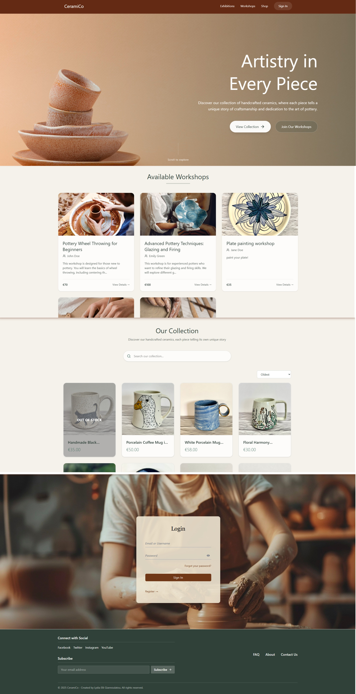

# 🎨 CeramiCo Project

<div style="display: flex; align-items: flex-start; gap: 2rem; margin: 2rem 0;">
  <div style="flex: 1;">
    <p><strong>CeramiCo</strong> is my graduation project for <strong>Social Hackers Academy</strong>.</p>    
    <p>With a background in Fine Arts and a love for working with clay, I originally envisioned opening a physical pottery studio. But discovering Full Stack Development opened a new creative path — this platform blends both passions: <strong>pottery and programming</strong>.</p>    
    <h3>🎯 Features:</h3>
    <ul>
      <li>E-commerce functionality</li>
      <li>User authentication system</li>
      <li>Secure payment processing</li>
      <li>Admin dashboard</li>
      <li>Responsive design</li>
    </ul>
            <h3>🛠️ Technologies Used:</h3>
    <table style="width: 100%; border-collapse: collapse; margin-top: 1rem;">
      <thead>
        <tr style="background-color:rgba(248, 249, 250, 0.17);">
          <th style="border: 1px solid #dee2e6; padding: 8px; text-align: left;">Backend</th>
          <th style="border: 1px solid #dee2e6; padding: 8px; text-align: left;">Frontend</th>
        </tr>
      </thead>
      <tbody>
        <tr>
          <td style="border: 1px solid #dee2e6; padding: 6px;">Node.js</td>
          <td style="border: 1px solid #dee2e6; padding: 6px;">React 19</td>
        </tr>
        <tr style="background-color:rgba(8, 83, 24, 0.14);">
          <td style="border: 1px solid #dee2e6; padding: 6px;">Express</td>
          <td style="border: 1px solid #dee2e6; padding: 6px;">React Router DOM</td>
        </tr>
        <tr>
          <td style="border: 1px solid #dee2e6; padding: 6px;">MongoDB</td>
          <td style="border: 1px solid #dee2e6; padding: 6px;">React Toastify</td>
        </tr>
        <tr style="background-color:rgba(8, 83, 24, 0.14);">
          <td style="border: 1px solid #dee2e6; padding: 6px;">Mongoose</td>
          <td style="border: 1px solid #dee2e6; padding: 6px;">Axios</td>
        </tr>
        <tr>
          <td style="border: 1px solid #dee2e6; padding: 6px;">Bcrypt</td>
          <td style="border: 1px solid #dee2e6; padding: 6px;">Tailwind CSS 4</td>
        </tr>
        <tr style="background-color:rgba(8, 83, 24, 0.14);">
          <td style="border: 1px solid #dee2e6; padding: 6px;">CORS</td>
          <td style="border: 1px solid #dee2e6; padding: 6px;">Vite</td>
        </tr>
        <tr>
          <td style="border: 1px solid #dee2e6; padding: 6px;">JWT</td>
          <td style="border: 1px solid #dee2e6; padding: 6px;">Stripe React</td>
        </tr>
        <tr style="background-color:rgba(8, 83, 24, 0.14);">
          <td style="border: 1px solid #dee2e6; padding: 6px;">Nodemailer</td>
          <td style="border: 1px solid #dee2e6; padding: 6px;">Lucide React</td>
        </tr>
        <tr>
          <td style="border: 1px solid #dee2e6; padding: 6px;">Cloudinary</td>
          <td style="border: 1px solid #dee2e6; padding: 6px;">React Slick</td>
        </tr>
        <tr style="background-color:rgba(8, 83, 24, 0.14);">
          <td style="border: 1px solid #dee2e6; padding: 6px;">Stripe</td>
          <td style="border: 1px solid #dee2e6; padding: 6px;">Headless UI</td>
        </tr>
        <tr>
          <td style="border: 1px solid #dee2e6; padding: 6px;">Node Cron</td>
          <td style="border: 1px solid #dee2e6; padding: 6px;">JWT Decode</td>
        </tr>
      </tbody>
    </table>
  </div>
  
  <div style="flex: 1;">
    
  </div>
</div>

---

## 🚀 Getting Started

Follow these steps to run **CeramiCo** locally on your machine.

### 🔧 Prerequisites

- [Node.js](https://nodejs.org/) installed (v16 or higher recommended)
- [MongoDB](https://www.mongodb.com/) (local or cloud instance)
- [Stripe CLI](https://stripe.com/docs/stripe-cli#install) for webhook testing
- A Stripe account (recommended for full functionality)
- (Optional) Cloudinary account for image hosting
- Gmail account for email notifications (used with Nodemailer)

---

###  📁 1. Clone the Repository

```bash
git clone https://github.com/yourusername/ceramico.git
cd ceramico
```

---

### ⚙️ 2. Setup Environment Variables

Create .env files inside both backend and client directories, based on the .env.example file.

---

### 📦 3. Install Dependencies

Install packages for backend and frontend:

```bash
# Backend
cd backend
npm install

# Frontend
cd ../client
npm install
```

---

### ▶️ 4. Run the Application

```bash
# Backend
cd backend
npm start


# Frontend
cd ../client
npm run dev
```

---

### 💳 5. Stripe Webhook Listener (for local development)

To simulate real payment events locally:

#### 1. Install Stripe CLI (if not done already):

https://stripe.com/docs/stripe-cli#install

#### 2. Run the webhook listener:

```bash
stripe listen --forward-to localhost:3050/payment/webhook
```

In order to test the payment:

- Card Number: 4242 4242 4242 4242
- CVC: any 3 digits
- Date: any future date

for more information check out this : https://docs.stripe.com/testing


✅ You're Ready!

---

## 🌐 Deployment

- This is the deployed site: https://ceramico.netlify.app/
- This project is actively being enhanced as I continue to learn and apply new concepts.

## 📝 Notes

Because this is a graduation project, some security practices were relaxed to ease testing:

- Password requirements are minimal — there are no enforced rules for length or special characters.

- Test cards (like 4242 4242 4242 4242) are accepted for Stripe payments.

- No CAPTCHA or rate limiting is implemented for authentication.

Please keep in mind these decisions were made intentionally for demonstration purposes and would be revised in a production-ready version.

For checking admin functionalities contact lydiaelliegiannoulatou@gmail.com
